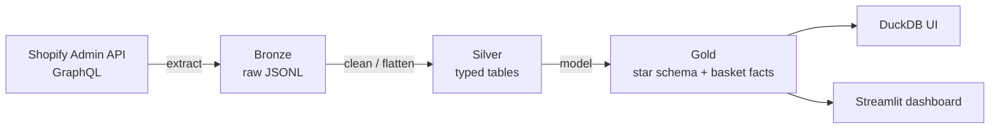

# Shopify Data Pipeline - Naya DE Mid Project

An end-to-end data engineering pipeline over **Shopify e-commerce data**, built for the
Naya College Data Engineering course.
Raw Shopify data is extracted, cleaned, and modeled through a **medallion architecture
(bronze → silver → gold)** on **DuckDB**, then served to two analyses:

1. **Multi dimensional sales analysis** — revenue & units sliced by marketing source, product, category, vendor, time, and customer type.
2. **Market basket analysis** — which products / vendors are bought together (pairs *and* arbitrary-size groups) via support, confidence, and lift.

Everything is runnable with one command and viewable in a Streamlit dashboard.

---

## Architecture



- **Bronze** — raw API responses saved verbatim as JSONL (one node per line), nothing thrown away.
- **Silver** — cleaned, typed, flattened tables (one clean row per business entity).
- **Gold** — analysis-ready star schema (dimensions + facts) plus the basket facts.
- **Warehouse** — a single embedded DuckDB file (`data/warehouse.duckdb`) with two schemas: `silver`, `gold` (bronze stays as files).

---

## Data source

- A **free Shopify development store** (`ofek-dev-store`) standing in for Chozen (no live access yet).
- Catalog from Shopify's "Simple Sample Data" app: **47 products** across categories/vendors.
- **~2,371 synthetic orders** generated over the past year (`generate_orders.py`), each with a random basket (1–5 items), a marketing-`source` tag (meta / google / organic / direct), and a customer (60% returning / 40% new). **7,060 line items**, **919 customers**.
- Pulled via the **GraphQL Admin API** (cursor pagination, cost-bucket rate limiting).

---

## The layers in detail

### Bronze — `extract*.py`
A shared engine (`extract.py`: `extract_data` + `extract_to_bronze`) handles auth, pagination, and writing JSONL; thin per-entity runners supply the GraphQL query (`extract_orders`, `extract_products`, `extract_customers`).

### Silver — `silver_*.py` (schema `silver`)
| Table | Grain | Notes |
|-------|-------|-------|
| `orders` | one order | parses `source` from tags, `processed_at` as order date, strips Shopify GID prefixes |
| `order_items` | one line item | flattens `lineItems`; carries `quantity`, **`unit_price`, `line_revenue`** |
| `products` | one product | title-cased category & vendor, empty→null |
| `customers` | one customer | city / country from default address |

### Gold — `gold_*.py` (schema `gold`)
**Dimensions:** `dim_product`, `dim_customer`.
**Facts:**
| Fact | Grain | Purpose |
|------|-------|---------|
| `fact_orders` | one order | order revenue, source, date, **new/returning** customer type |
| `fact_order_items` | one line item | the **sales-analysis surface** — revenue/units by any dimension |
| `fact_product_pairs` / `fact_vendor_pairs` | one pair | basket pairs: support, confidence (A→B & B→A), lift |
| `fact_product_groups` / `fact_vendor_groups` | one group (size 2–5) | frequent itemsets: support, lift, size-selectable via `group_size` |

---

## Key engineering decisions

- **Line-item revenue** —  Verified: line revenue reconciles to order totals within **0.006%**.
- **Grain discipline** — order-level money lives only on `fact_orders`; line-level money on `fact_order_items`. Never mixed, so `SUM` never double-counts.
- **New vs returning** is computed per order with a `ROW_NUMBER()` window (first order = new), not from a lifetime snapshot.
- **Basket math** — presence not quantity (an item counts once per order); pairs ordered `a < b`; lift = support(set) / ∏support(item). Confidence is kept only for pairs (it's a directional rule and doesn't generalize to groups). Validated on a hand-checked toy dataset.
- **Custom JSONL logger** (`logger.py`) — structured, Hebrew-safe, one event per line, daily files.
- **Secrets** — real token in gitignored `credentials.py`, with a `credentials_example.py` fallback so a fresh clone never crashes on import.
- **Exploration notebooks** validate every layer (unique keys, nulls, referential integrity, revenue reconciliation, no fan-out).

>**Honest caveat:** orders use *random* baskets, so market-basket **lift sits near 1.0** (chance). The pipeline and method are the deliverable; real associations are expected once live Chozen data is used in the final project.

---

## How to run

```bash
# 1. install
python -m venv .venv && .venv\Scripts\activate      # Windows
pip install -r requirements.txt

# 2. add your Shopify token
#    copy credentials_example.py -> credentials.py and paste a real shpat_ token

# 3. build the warehouse
python run_pipeline.py            # full: extract from Shopify -> silver -> gold
python run_pipeline_local.py      # offline: silver -> gold from existing bronze (no API)

# 4. explore
python duckdb_ui.py               # warehouse browser at localhost:4213
python dashboard.py               # Streamlit dashboard (also: streamlit run dashboard.py)
```
*(DuckDB is single-writer — close the UI/dashboard before running the pipeline.)*

---

## Repo structure

```
extract.py, extract_*.py      bronze: shared engine + per-entity runners
silver_*.py                   silver: clean/typed tables
gold_dim_*.py, gold_fact_*.py gold: dimensions + facts (sales + basket)
warehouse.py                  DuckDB connection + read/write helpers
config.py / credentials*.py   settings + secrets
logger.py                     custom JSONL logger
bronze_reader.py              reads latest bronze JSONL
generate_orders.py            one-off synthetic-order seeding (not part of ETL)
run_pipeline.py               full pipeline (bronze→silver→gold)
run_pipeline_local.py         offline rebuild (silver→gold)
duckdb_ui.py                  launches the DuckDB local web UI
dashboard.py                  Streamlit dashboard
*_exploration.ipynb           per-layer explore + validate notebooks
```

